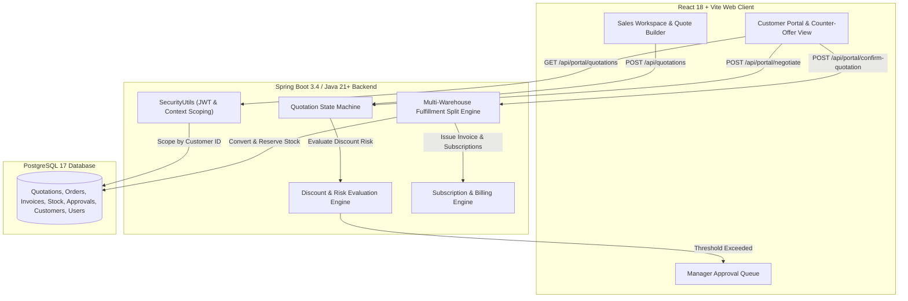

# DealFlow360 — Enterprise B2B Quotation, Approval, Negotiation & Fulfillment Engine

DealFlow360 is a production-grade, self-governing B2B Sales Operations and Deal Management Platform built using **Spring Boot (Spring JDBC + PostgreSQL)** and **React (Vite + TailwindCSS)**. 

It powers the complete commercial lifecycle: from dynamic catalog pricing and tiered discount risk evaluation to multi-level approval workflows, real-time customer counter-offer negotiations, atomic order conversion, multi-warehouse fulfillment splitting, and recurring subscription billing.

---

## 🌟 Core System Capabilities

### 1. 🛡️ Strict Backend Quotation State Machine
* **Deterministic Lifecycle Enforcement**: Quotation status transitions are governed by an immutable state engine:
  ```
  [DRAFT] ──> [SENT] ──> [UNDER_NEGOTIATION] ──> [PENDING_APPROVAL] ──> [APPROVED] ──> [CONFIRMED (Order Created)]
    │           │                                      │                                 │
    └──> [REJECTED] ───────────────────────────────────┴─────────────────────────────────┴──> [RETURNED_FOR_REVISION]
  ```
* **Confirmation Safeguards**: Quotations can ONLY transition to `CONFIRMED` when in valid `SENT` or `APPROVED` states. Re-confirmation of already `CONFIRMED` quotes is strictly blocked to prevent duplicate order creation.

### 2. 🔐 Multi-Tenant Security & Customer Scoping (IDOR Prevention)
* **JWT Identity Context**: Resolves authenticated user identity directly from JWT SecurityContext via `SecurityUtils` (never trusting frontend-supplied `customerId` or `quotationId`).
* **Customer Scoping**: Customers access **only** their own quotations, orders, invoices, payments, and counter-offer logs. Cross-customer IDOR access attempts return `403 FORBIDDEN` or `404 NOT FOUND`.
* **5 Role-Based Access Control (RBAC) System**:
  - `ADMIN`: Full administrative control, governance policies, and system audit logs.
  - `SALES_MANAGER`: Sales team management, high-discount approval overrides, deal health monitoring.
  - `FINANCE`: Credit checks, invoice issuance, payment verification, and financial reporting.
  - `SALES_REP`: Quotation builder, pricing overrides, customer negotiation responses.
  - `CUSTOMER`: Dedicated Customer Portal access for viewing published quotes, proposing counter-offers, and confirming orders.

### 3. 📊 Tiered B2B Discount & Risk Engine
* **Automated Risk Scoring**: Evaluates line-item unit prices against base list prices, customer discount tiers (`BRONZE`, `SILVER`, `GOLD`, `PLATINUM`), and category ceiling limits.
* **Approval Triggers**: Automatically routes quotations exceeding discount thresholds to `PENDING_APPROVAL` for manager authorization before customer confirmation.

### 4. 💬 Live Customer Counter-Offer Negotiation Portal
* **Transparent Portal View**: Published quotations (`SENT`, `UNDER_NEGOTIATION`, `CONFIRMED`) are rendered in a dedicated Customer Portal with clear breakdown of list pricing, discount savings, tax, and net payable totals.
* **Bi-Directional Negotiations**: Customers propose counter-offer discount percentages or line-item change requests, transitioning the quotation to `UNDER_NEGOTIATION` while tracking full proposal history logs.

### 5. 📦 Automated Multi-Warehouse Order Fulfillment
* **Atomic Order Creation**: Converts confirmed quotations into orders and line items in a single database transaction.
* **Multi-Warehouse Auto-Split**: Calculates optimal fulfillment allocations across regional warehouses, reserves available stock, and generates backorders (`STOCK_DEFICIT`) when inventory is constrained.

### 6. 🔄 Hybrid Subscription & Billing Engine
* **Itemized Recurring Charges**: Supports hybrid orders containing both one-time hardware/license purchases and monthly recurring cloud subscriptions.
* **Automated Schedule Generation**: Generates subscription billing schedules, handles demo PIN payments, and tracks payment history.

---

## 🏗️ Architecture & Component Flow



---

## 🛠️ Technology Stack

### **Backend (`DealFlow360_backend`)**
* **Framework**: Spring Boot 3.4 / Java 21+
* **Data Access**: Spring JDBC (`JdbcTemplate`), Spring Data Persistence
* **Database**: PostgreSQL 17
* **Migrations**: Flyway DB (`V1__` through `V12__comprehensive_b2b_seed_data.sql`)
* **Security**: Spring Security 6, JWT Authentication (HMAC-SHA256), Password Hashing (`BCrypt`)
* **Testing**: JUnit 5, Mockito, Spring Boot Test (**313 unit & integration tests**)

### **Frontend (`DealFlow360_frontend`)**
* **Framework**: React 18, Vite 8
* **Routing**: React Router v6
* **Styling**: Vanilla CSS / Custom TailwindCSS Design System (Glassmorphism, Dark/Light palettes)
* **Icons**: Lucide React Icons

---

## 📁 Repository Structure

```
DealFlow360/
├── DealFlow360_backend/
│   ├── src/main/java/com/odoo/DealFlow360/
│   │   ├── approval/         # Multi-level approval chains & threshold rules
│   │   ├── billing/          # Invoices, payments, credit notes
│   │   ├── customer/         # B2B customer management & portal accounts
│   │   ├── dashboard/        # Executive metrics & KPI aggregation
│   │   ├── dealhealth/       # Dynamic deal risk scoring & alerts
│   │   ├── discount/         # Tiered discount evaluation engine
│   │   ├── fulfillment/      # Order conversion & warehouse split engine
│   │   ├── inventory/        # Multi-warehouse stock tracking
│   │   ├── negotiation/      # Counter-offer negotiation portal & requests
│   │   ├── pricing/          # Dynamic price lists & volume tiers
│   │   ├── product/          # Product catalog & variant management
│   │   ├── quotation/        # Core quotation state machine & line builder
│   │   ├── recommendation/   # Upsell & cross-sell recommendation rules
│   │   ├── reporting/        # Sales analytics & export engine
│   │   ├── security/         # SecurityUtils, JWT Filter, Auth Helpers
│   │   ├── subscription/     # Recurring subscription billing schedules
│   │   └── user/             # Identity management & 5 RBAC roles
│   ├── src/main/resources/
│   │   ├── application.properties
│   │   └── db/migration/     # Flyway SQL schema migrations (V1-V12)
│   └── src/test/java/        # JUnit 5 backend test suites (313 tests)
│
└── DealFlow360_frontend/
    ├── src/
    │   ├── api/              # API Fetch client & endpoints (quotation, portal, auth, etc.)
    │   ├── components/       # Common UI badges, Navbar, Sidebar, Modals
    │   ├── context/          # AuthContext & Session management
    │   ├── pages/            # Role-specific views (Workspace, Customer Portal, Approvals, Orders)
    │   └── main.jsx
    └── vite.config.js
```

---

## 🚀 Quick Start Guide

### Prerequisites
* **Java**: JDK 21 or 24
* **Node.js**: v18+ and npm
* **Database**: PostgreSQL 17 running on `localhost:5432` with database `dealflow360`

### 1. Database Setup
Create PostgreSQL database:
```sql
CREATE DATABASE dealflow360;
```
*(Default credentials in `application.properties`: user `postgres`, password `postgres`)*

### 2. Launch Backend
Navigate to `DealFlow360_backend` and run:
```bash
# Windows
.\mvnw.cmd spring-boot:run

# Linux / macOS
./mvnw spring-boot:run
```
The Flyway migrations will automatically execute `V1` through `V12`, seeding **60 B2B customers, 5 sales teams, stock catalog, price lists, and sample quotations**.

Backend running at: `http://localhost:8084`

### 3. Launch Frontend
Navigate to `DealFlow360_frontend` and run:
```bash
npm install
npm run dev
```
Frontend running at: `http://localhost:5173`

---

## 🔐 Seed Demo Credentials

| Role | Email | Password | Access / Portal View |
| :--- | :--- | :--- | :--- |
| **System Admin** | `admin@dealflow360.com` | `Password123!` | Full System Workspace, System Audit, Governance |
| **Sales Manager** | `jordan.mgr@dealflow360.com` | `Password123!` | Approval Queue, Discount Overrides, Team Analytics |
| **Sales Rep** | `alex.rep@dealflow360.com` | `Password123!` | Quotation Builder, Customer Publishing, Counter Responses |
| **Finance / Ops** | `fiona.fin@dealflow360.com` | `Password123!` | Invoices, Payments, Subscription Billing Schedules |
| **B2B Customer** | `procurement@acmetech.com` | `Password123!` | Customer Portal (`/portal`), Quotation Negotiation & Order Confirmation |
| **B2B Customer** | `buying@vertexmfg.com` | `Password123!` | Customer Portal (`/portal`) for Vertex Manufacturing |

---

## 🧪 Testing & Verification

### Running Backend Unit & Integration Tests
```bash
cd DealFlow360_backend
.\mvnw.cmd test
```
*Executes all **313 tests** covering quotation state transitions, discount risk rules, inventory allocations, and cross-customer security checks.*

### Running Frontend Production Build
```bash
cd DealFlow360_frontend
npm run build
```

---

## 📄 License
Internal Production Release — Developed for DealFlow360 Platform.
